# Oyun Fiziği: Sıfırdan İleri Seviyeye Kapsamlı Ders Notu

---

## BÖLÜM 1: TEMEL KAVRAMLAR

### 1.1 Fizik Nedir? Oyun Fiziği Nedir?

**Fizik**, evrendeki madde ve enerjinin nasıl davrandığını inceleyen bilim dalıdır. Bir topun yere düşmesi, arabanın fren yapması, suyun akması — hepsi fizik kurallarıyla açıklanır.

**Oyun fiziği (game physics)** ise bu gerçek dünya kurallarının bir bilgisayar oyununda **taklit edilmesidir (simülasyon)**. Amaç, oyuncuya nesnelerin gerçekçi (veya gerçekçiye yakın) davrandığı hissini vermektir.

**Neden "taklit" diyoruz?**
Çünkü gerçek fiziği birebir hesaplamak imkansıza yakındır. Gerçek dünyada her atomun her etkileşimi hesaplanır. Oyunda ise saniyede 60 kez (veya daha sık) yaklaşık hesaplar yaparız. Bu yüzden oyun fiziği her zaman bir **yaklaşımdır (approximation)**.

**Örnek:**
- Gerçek dünyada bir elma düşerken hava molekülleriyle milyarlarca etkileşime girer.
- Oyunda elma sadece "yerçekimi kuvveti" ve "hava direnci" ile hesaplanır. Geri kalan her şey ihmal edilir.

### 1.2 Neden Oyunlarda Fizik Önemli?

1. **Gerçekçilik hissi:** Oyuncu, nesnelerin doğal davrandığını görünce dünyaya inanır.
2. **Oynanış mekaniği:** Fizik, oyunun temel mekaniği olabilir (Angry Birds, Portal).
3. **Etkileşim:** Oyuncu nesneleri itebilir, kırabilir, fırlatabilir.
4. **Bulmaca tasarımı:** Fizik tabanlı bulmacalar (Portal, The Talos Principle).
5. **Görsel efekt:** Patlamalar, yıkımlar, parçacıklar.

### 1.3 Temel Fiziksel Büyüklükler

Oyun fiziğinde kullanılan temel büyüklükler:

| Büyüklük | Sembol | Birim | Açıklama |
|---|---|---|---|
| Konum | x, p | m (metre) | Nerede olduğu |
| Hız | v | m/s | Konumun değişim hızı |
| İvme | a | m/s² | Hızın değişim hızı |
| Kütle | m | kg | Madde miktarı |
| Kuvvet | F | N (Newton) | İtme/çekme |
| Momentum | p | kg·m/s | Hareket miktarı |
| Enerji | E | J (Joule) | İş yapabilme kapasitesi |
| Tork | τ | N·m | Döndürme kuvveti |
| Açısal hız | ω | rad/s | Dönme hızı |
| Açısal ivme | α | rad/s² | Dönme ivmesi |

**Hız vs İvme — Anlaşılır Açıklama:**

- **Hız (v):** "Şu an ne kadar hızlı gidiyorum?" — 5 m/s diyorsak, her saniye 5 metre yol alıyoruz.
- **İvme (a):** "Hızım ne kadar değişiyor?" — 2 m/s² diyorsak, her saniye hızımız 2 m/s artıyor.

**Örnek:**
```
t=0: v=0 m/s (duruyor)
t=1: v=2 m/s
t=2: v=4 m/s
t=3: v=6 m/s
```
Burada ivme = 2 m/s² (her saniye +2 m/s)

---

## BÖLÜM 2: NEWTON YASALARI VE TEMEL HAREKET

### 2.1 Newton'un 1. Yasası (Eylemsizlik)

> "Bir cisim, üzerine net bir kuvvet uygulanmadıkça, duruyorsa durmaya, hareket ediyorsa sabit hızla hareket etmeye devam eder."

**Oyunlarda:**
- Uzayda bir gemi iticiyi kapatınca sonsuza kadar gider (Asteroids).
- Sürtünme olmayan zeminde kutu durmaz.

**Neden önemli?** Çünkü oyunlarda sürtünme olmasa nesneler asla durmaz. Bu yüzden genelde yapay sürtünme ekleriz.

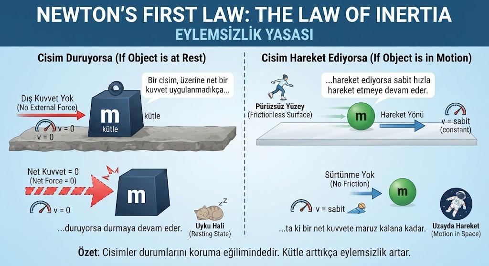

### 2.2 Newton'un 2. Yasası (F = m·a)

> "Bir cisme uygulanan net kuvvet, kütlesi ile ivmesinin çarpımına eşittir."

```
F = m · a
```

Buradan:
```
a = F / m
```
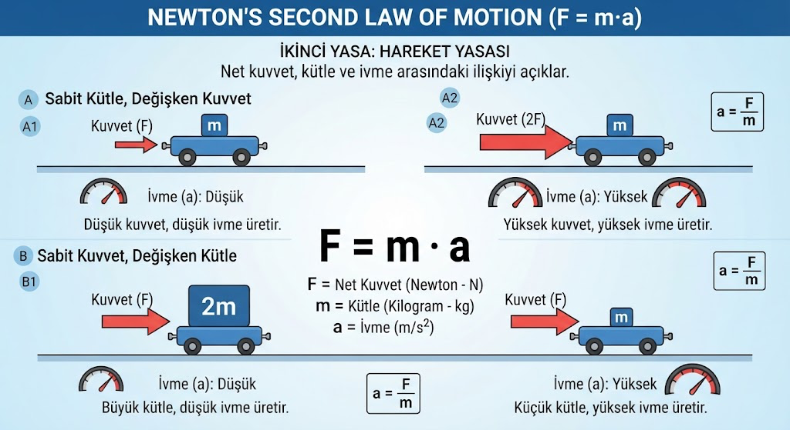

****
- Aynı kuvveti hafif cisme uygularsan çok hızlanır.
- Aynı kuvveti ağır cisme uygularsan az hızlanır.

**Örnek:**
- 1 kg topa 10 N kuvvet → a = 10/1 = 10 m/s²
- 5 kg topa 10 N kuvvet → a = 10/5 = 2 m/s²

**Oyunlarda:** Karakterin kütlesi, arabanın ağırlığı, merminin hızı hep bu yasayla hesaplanır.

### 2.3 Newton'un 3. Yasası (Etki-Tepki)

> "Her etkiye karşı eşit büyüklükte ve zıt yönde bir tepki vardır."

**Oyunlarda:**
- Silah ateşlenince karakter geriye iter (recoil).
- Roket yakıt püskürtünce roket ileri gider.
- İki araba çarpışınca ikisi de birbirini iter.

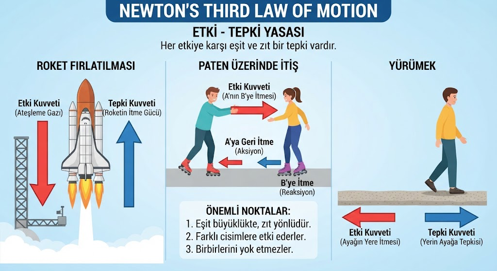

### 2.4 Hareket Denklemleri (Kinematik)

Sabit ivmeli hareket için:

```
v = v₀ + a·t          (hız-zaman)
x = x₀ + v₀·t + ½·a·t²   (konum-zaman)
v² = v₀² + 2·a·(x - x₀)  (hız-konum)
```

**Örnek:** Araba 0'dan başlayıp 3 m/s² ivmeyle 5 saniye hızlanırsa:
```
v = 0 + 3·5 = 15 m/s
x = 0 + 0 + ½·3·25 = 37.5 m
```
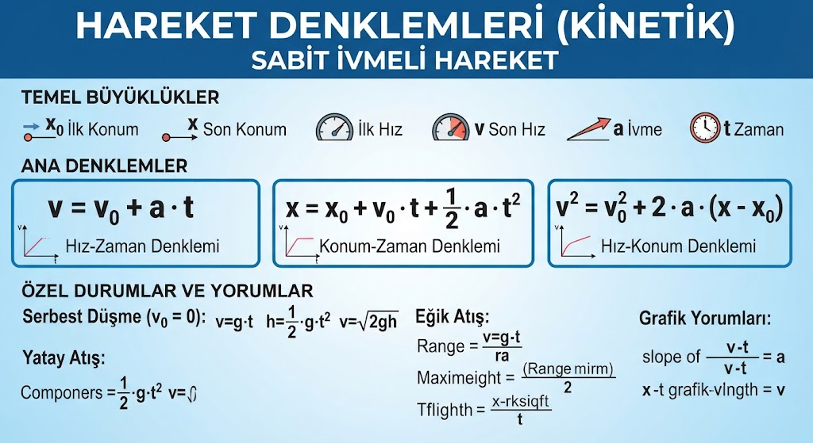

### 2.5 Yerçekimi

Dünya'da yerçekimi ivmesi: **g ≈ 9.81 m/s²**

Yerçekimi kuvveti:
```
F = m · g
```
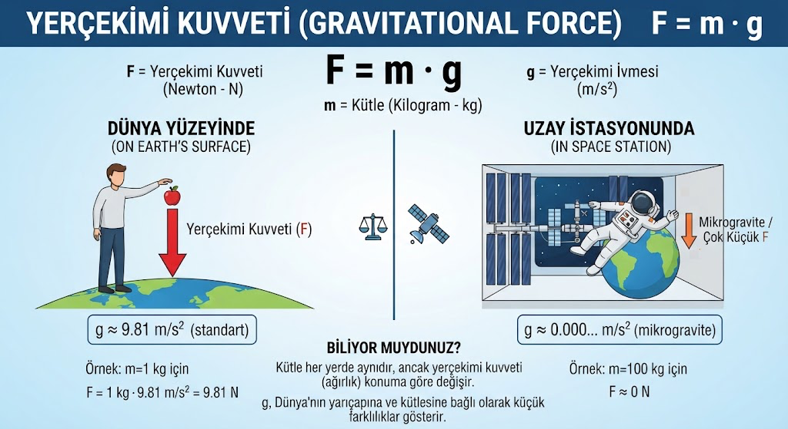

**Serbest düşme:**
```
v = g·t
h = ½·g·t²
v = √(2·g·h)
```

**Örnek:** 2 saniye düşen cisim:
```
v = 9.81·2 = 19.62 m/s
h = ½·9.81·4 = 19.62 m
```

**Oyunlarda:** Genelde g = 9.81 kullanılmaz. Oynanışa göre 20-50 arası değerler daha "eğlenceli" hissettirir.

---

## BÖLÜM 3: PHYSICS ENGINE NEDİR?

### 3.1 Tanım

**Physics engine (fizik motoru)**, fizik hesaplamalarını yapan yazılım kütüphanesidir. Oyun geliştirici, fizik yasalarını sıfırdan yazmak zorunda kalmaz; motorun hazır fonksiyonlarını kullanır.

**Benzetme:**
- **Oyun motoru (Unity, Unreal):** Araba gibi. Her şeyi bir arada sunar.
- **Physics engine (PhysX, Box2D):** Arabanın motoru gibi. Sadece hareketi sağlar.

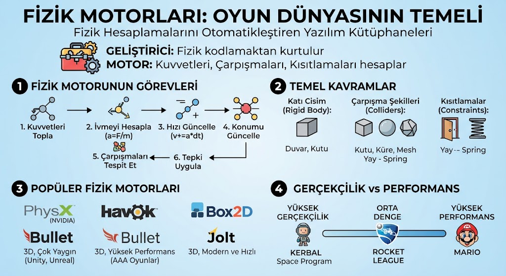

### 3.2 Physics Engine Ne Yapar?

1. **Kuvvetleri toplar:** Yerçekimi, itki, sürtünme, yay.
2. **İvmeyi hesaplar:** a = F/m
3. **Hızı günceller:** v += a·Δt
4. **Konumu günceller:** x += v·Δt
5. **Çarpışmaları bulur:** Hangi nesneler birbirine değiyor?
6. **Tepki uygular:** Çarpışma sonrası hızları değiştirir.
7. **Kısıtlamaları çözer:** Eklemler, bağlantılar.

### 3.3 Popüler Physics Engine'ler

| Motor | Tür | Kullanım |
|---|---|---|
| **PhysX** | 3D | Unity, Unreal, AAA |
| **Havok** | 3D | AAA, film |
| **Bullet** | 3D | Açık kaynak, robotik |
| **Box2D** | 2D | Angry Birds, indie |
| **Rapier** | 2D/3D | Rust, modern |
| **Jolt** | 3D | Modern, hızlı |

### 3.4 Physics Engine'in Ana Döngüsü (Adım Adım)

```
Her kare (frame):
  1. Kuvvetleri sıfırla
  2. Yerçekimi ekle: F += m·g
  3. Diğer kuvvetleri ekle (itki, yay, sürtünme)
  4. İvmeyi hesapla: a = F/m
  5. Hızı güncelle: v = v + a·Δt
  6. Konumu güncelle: x = x + v·Δt
  7. Çarpışmaları tespit et
  8. Çarpışma tepkilerini uygula
  9. Kısıtlamaları çöz
  10. Uyuyan cisimleri kontrol et
```

**Neden bu sıra?** Çünkü fizik, zaman içinde nedensel ilerler: önce kuvvet, sonra ivme, sonra hız, sonra konum.

---

## BÖLÜM 4: GERÇEKÇİLİK vs PERFORMANS

### 4.1 Temel Ödünleşim (Trade-off)

Oyun fiziğinde iki hedef çatışır:

1. **Gerçekçilik:** Fizik yasalarına tam uyum.
2. **Performans:** Saniyede 60+ kare, düşük CPU/GPU kullanımı.

**Gerçekçilik artarsa → Performans düşer.**
**Performans artarsa → Gerçekçilik düşer.**

### 4.2 Neden Tam Gerçekçilik Mümkün Değil?

Gerçek fizik hesaplamaları:
- Sürekli (continuous) — yani sonsuz küçük zaman adımları
- Karmaşık (her atom, her kuvvet)
- Yavaş (süper bilgisayar gerektirir)

Oyun fiziği:
- Ayrık (discrete) — saniyede 60 kez
- Basitleştirilmiş (sadece büyük kuvvetler)
- Hızlı (tek CPU çekirdeği)

### 4.3 Gerçekçilik ve Performans Dengesi Örnekleri

| Oyun | Gerçekçilik | Performans | Tercih |
|---|---|---|---|
| Kerbal Space Program | Çok yüksek | Düşük | Gerçekçilik |
| Angry Birds | Orta | Yüksek | Denge |
| Mario | Düşük | Çok yüksek | Performans |
| BeamNG.drive | Çok yüksek | Düşük | Gerçekçilik |
| Rocket League | Orta-yüksek | Yüksek | Denge |

### 4.4 Zaman Adımı (Timestep) Kavramı

**Zaman adımı (Δt)**, fizik hesaplamasının ne sıklıkla yapıldığıdır.

**Örnek:**
- 60 FPS → Δt = 1/60 ≈ 0.0167 saniye     FPS(saniyedeki kare sayısı (Frames Per Second))
- 30 FPS → Δt = 1/30 ≈ 0.0333 saniye

**Formül:**
```
x_new = x_old + v · Δt
```

**Sorun:** Δt büyükse hata artar.

**Örnek:**
- Δt = 0.0167, v = 10 m/s → x += 0.167 m (doğru)
- Δt = 0.1, v = 10 m/s → x += 1 m (kaba ama hızlı)

### 4.5 Sabit vs Değişken Zaman Adımı

**Değişken zaman adımı (Variable timestep):**
```
Δt = şu anki kare süresi
```
- **Avantaj:** Basit, FPS düşünce yavaşlamaz.
- **Dezavantaj:** Kararsız, tekrarlanabilir değil.

**Sabit zaman adımı (Fixed timestep):**
```
Δt = her zaman 1/60
```
- **Avantaj:** Kararlı, deterministik.
- **Dezavantaj:** Yavaş makinelerde yavaşlar.

**Accumulator (Biriktirici) yöntemi:**
```c
double accumulator = 0;
while (gameRunning) {
    double frameTime = getFrameTime();
    accumulator += frameTime;
    while (accumulator >= FIXED_DT) {
        physicsStep(FIXED_DT);   // sabit adım
        accumulator -= FIXED_DT;
    }
    render(interpolate(accumulator / FIXED_DT));
}
```

****
- Her karede geçen süreyi akümülatöre ekle.
- akümülatör sabit adımdan büyükse, fizik adımı at.
- Kalan akümülatörü render'da interpolasyon için kullan.

---

## BÖLÜM 5: OYUNLARDA FİZİK TÜRLERİ

### 5.1 Arcade Fizik

**Tanım:** Gerçekçilikten çok **oynanış hissi (game feel)** önceliklidir.

**Özellikler:**
- Abartılı yerçekimi (gerçekte 9.81, oyunda 30)
- Yüksek zıplama
- Havada kontrol (air control)
- Basit çarpışma
- Sürtünme ihmal edilir

**Örnekler:** Mario, Sonic, Celeste, Cuphead

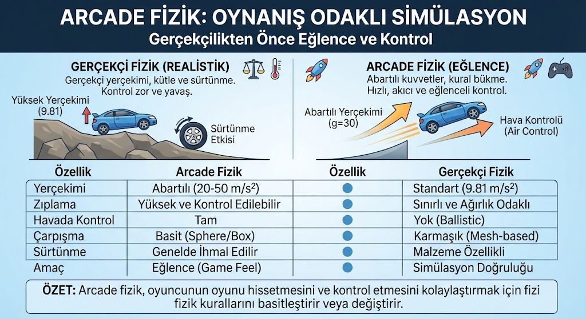

**Neden tercih edilir?**
- Daha eğlenceli
- Daha kontrol edilebilir
- Daha az CPU

### 5.2 Realistic Fizik

**Tanım:** Gerçek dünya parametreleri kullanılır.

**Özellikler:**
- Gerçek yerçekimi (9.81 m/s²)
- Doğru kütle, atalet
- Sürtünme, hava direnci
- Malzeme özellikleri

**Örnekler:** Kerbal Space Program, BeamNG.drive, Gran Turismo

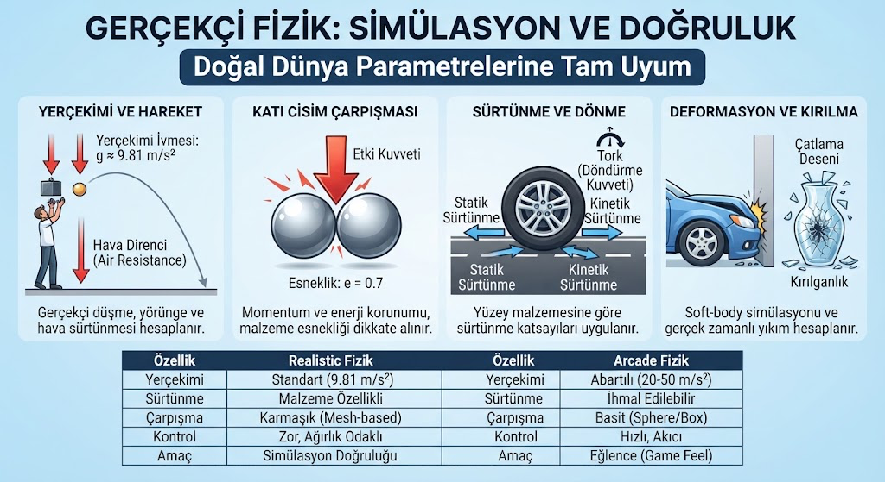

**Neden tercih edilir?**
- Simülasyon doğruluğu
- Öğrenme değeri
- Gerçekçilik hissi

### 5.3 Karşılaştırma Tablosu

| Kriter | Arcade | Realistic |
|---|---|---|
| Yerçekimi | Ayarlanabilir | 9.81 m/s² |
| Kütle | Sabit/önemsiz | Değişken |
| Çarpışma | Basit | Karmaşık |
| Öğrenme | Kolay | Zor |
| CPU | Düşük | Yüksek |
| Eğlence | Yüksek | Orta |
| Gerçekçilik | Düşük | Yüksek |

### 5.4 Ara Türler

- **Simcade:** Realistic + arcade (FIFA, Rocket League)
- **Stylized:** Sanatsal amaçla bükülmüş fizik (Portal)
- **Hybrid:** Bazı sistemler gerçekçi, bazıları arcade

---

## BÖLÜM 6: ÇARPIŞMA TESPİTİ (COLLISION DETECTION)

### 6.1 Çarpışma Nedir?

İki cismin uzayda aynı anda aynı yeri işgal etmesidir. Oyunda bunu tespit edip tepki vermemiz gerekir.

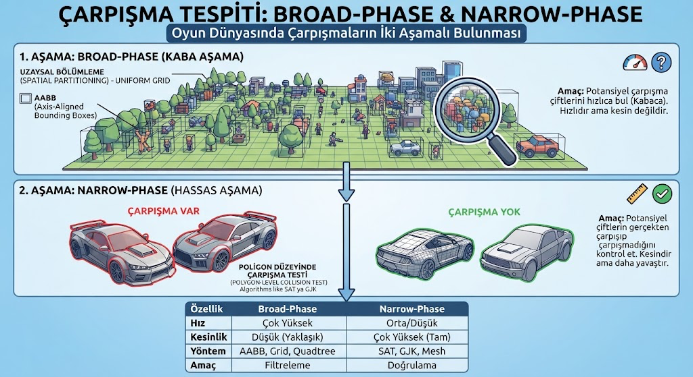

### 6.2 Neden İki Katmanlı?

Binlerce nesne varsa, hepsini birbiriyle test etmek çok yavaş olur:
```
n = 1000 nesne → n²/2 = 500.000 test
```

Bu yüzden iki aşama kullanılır:

**Broad-phase (Kaba aşama):**
- Amaç: Olası çarpışma çiftlerini bul.
- Yöntem: AABB, Spatial Hash, BVH.
- Hızlı ama kaba.

**Narrow-phase (Hassas aşama):**
- Amaç: Gerçekten çarpışıyorlar mı?
- Yöntem: SAT, GJK.
- Yavaş ama doğru.

**Benzetme:**
- Broad-phase: "Bu iki araba aynı mahallede mi?"
- Narrow-phase: "Gerçekten çarpıştılar mı?"

### 6.3 AABB (Axis-Aligned Bounding Box)

**Tanım:** Eksenlere paralel, cismi çevreleyen kutu.

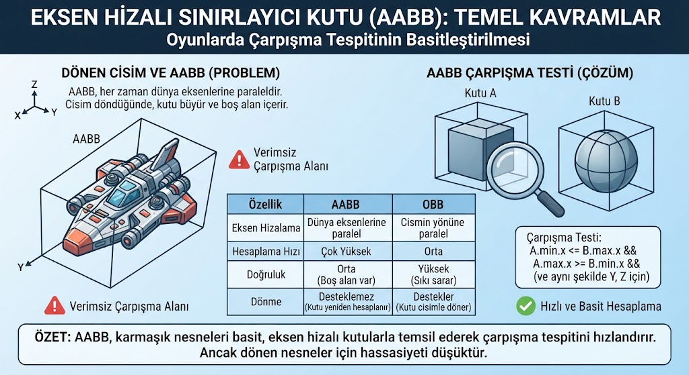

**Test:**
```c
bool aabbOverlap(AABB a, AABB b) {
    return (a.min.x <= b.max.x && a.max.x >= b.min.x) &&
           (a.min.y <= b.max.y && a.max.y >= b.min.y) &&
           (a.min.z <= b.max.z && a.max.z >= b.min.z);
}
```

**Ne demek?**
- Her eksende (x, y, z) iki kutunun aralıkları çakışıyor mu?
- Üç eksende de çakışıyorsa, kutular çarpışıyor.

**Avantaj:** Çok hızlı.
**Dezavantaj:** Dönen cisimlerde verimsiz (kutu büyür).

### 6.4 SAT (Separating Axis Theorem)

**Tanım:** İki dışbükey cisim ayrıktır, eğer bir eksen varsa ki bu eksende izdüşümleri çakışmıyorsa.

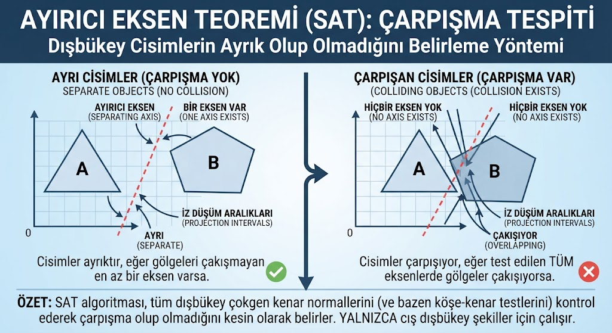

**Anlaşılır Açıklama:**
- İki cismi bir eksene yansıt (gölge gibi).
- Eğer bir eksende gölgeler çakışmıyorsa, cisimler ayrıktır.
- Hiçbir eksende ayıramıyorsan, çarpışıyorlar.

**2D'de test eksenleri:** Her poligonun her kenarının normali.

**Örnek:** İki kare için 4 eksen test edilir.

**Avantaj:** Kesin sonuç.
**Dezavantaj:** Sadece dışbükey cisimler için.

### 6.5 GJK (Gilbert-Johnson-Keerthi)

**Tanım:** İki dışbükey cisim arasındaki mesafeyi bulan algoritma.

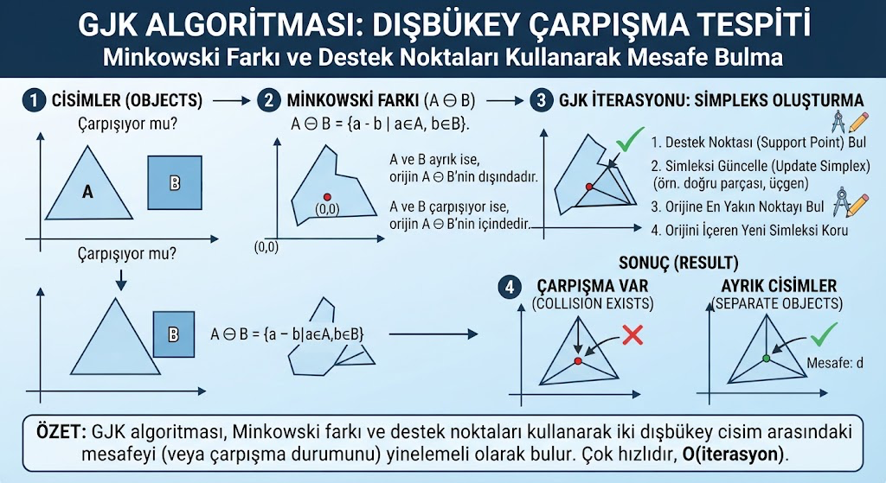

**Minkowski Farkı:**
```
A ⊖ B = { a - b | a ∈ A, b ∈ B }
```
Eğer orijin bu farkın içindeyse → çarpışma var.

**Avantaj:** Her dışbükey şekil için çalışır.
**Dezavantaj:** Karmaşık implementasyon.

### 6.6 Spatial Partitioning (Uzamsal Bölümleme)

**Tanım:** Uzayı küçük parçalara bölüp, sadece aynı parçadaki nesneleri test etme.

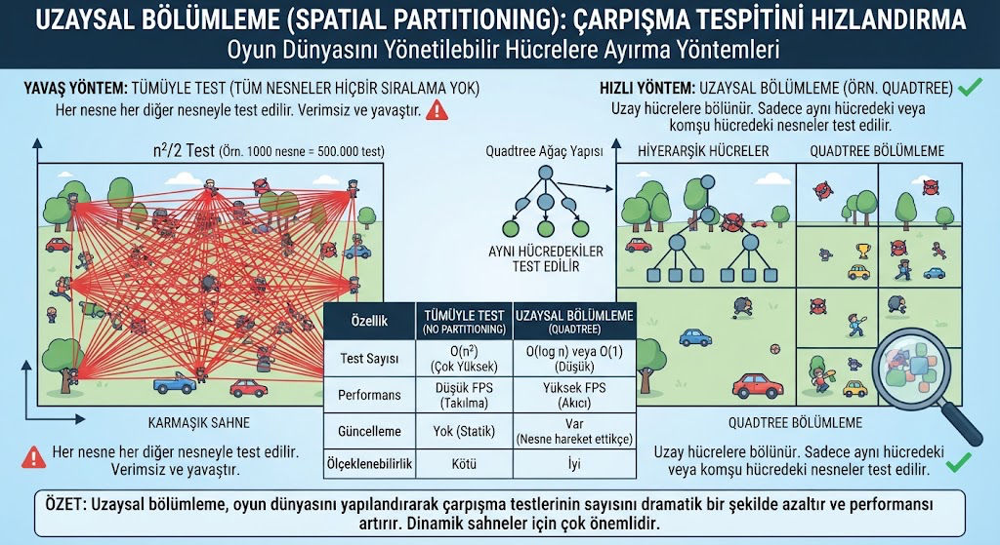

**Yöntemler:**

| Yöntem | Açıklama |
|---|---|
| **Uniform Grid** | Eşit kareler |
| **Quadtree** | 2D, 4 çocuk |
| **Octree** | 3D, 8 çocuk |
| **BVH** | Hiyerarşik kutu ağacı |
| **Spatial Hash** | Hash tablosu |

**Quadtree Örneği:**
```
+-------+-------+
|       |   |   |
|   A   |---+---|
|       | B | C |
+-------+---+---+
|   D   |   E   |
+-------+-------+
```
Her düğüm 4 çocuğa bölünür. Sadece aynı bölgedeki nesneler test edilir.

---

## BÖLÜM 7: ÇARPIŞMA TEPKİSİ (COLLISION RESPONSE)

### 7.1 Çarpışma Sonrası Ne Olur?

İki cisim çarpışınca:
1. Hızları değişir (momentum korunumu).
2. Enerji kaybı olabilir (esneklik).
3. Sürtünme etkisi olabilir.
4. İç içe girme (penetrasyon) düzeltilir.

### 7.2 Momentum Korunumu

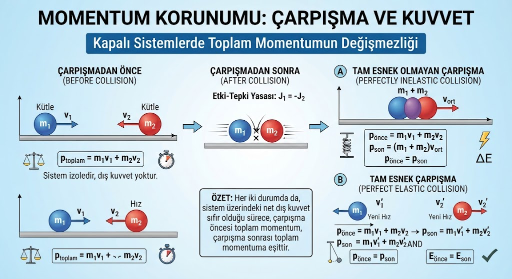

```
m₁·v₁ + m₂·v₂ = m₁·v₁' + m₂·v₂'
```

**Anlaşılır Açıklama:** Çarpışmadan önceki toplam momentum = çarpışmadan sonraki toplam momentum.

**Örnek:** 2 kg top 5 m/s ile 3 kg duran topa çarpıyor. Tam esnek (e=1):
```
2·5 + 3·0 = 2·v₁' + 3·v₂'
10 = 2v₁' + 3v₂'
```
Ayrıca esneklik: v₁ - v₂ = v₂' - v₁' (e=1 için)
```
5 - 0 = v₂' - v₁'
5 = v₂' - v₁'
```
Çözüm:
```
v₁' = -1 m/s (geri döndü)
v₂' = 4 m/s (ileri gitti)
```

### 7.3 Esneklik Katsayısı (Restitution)

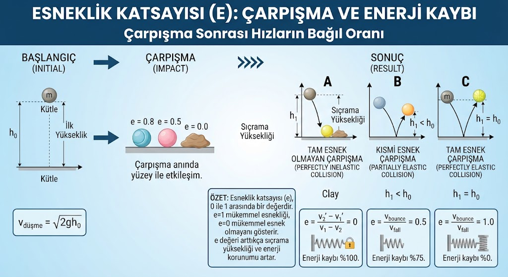

```
e = (v₂' - v₁') / (v₁ - v₂)
```

| e değeri | Anlam |
|---|---|
| e = 1 | Tam esnek (enerji korunur) |
| e = 0 | Tam esnek olmayan (yapışır) |
| 0 < e < 1 | Kısmi esnek (gerçekçi) |

**Malzeme örnekleri:**

| Malzeme | e |
|---|---|
| Kauçuk top | 0.8 |
| Basketbol | 0.75 |
| Tenis topu | 0.7 |
| Tahta | 0.4 |
| Beton | 0.2 |
| Çelik | 0.6 |

**Örnek:** 5 m yükseklikten düşen top, e=0.7:
```
v_düşme = √(2·9.81·5) ≈ 9.9 m/s
v_zıplama = 0.7 · 9.9 ≈ 6.93 m/s
h_zıplama = v²/(2g) = 48/19.62 ≈ 2.45 m
```
Enerji kaybı: %49

### 7.4 İmpuls Tabanlı Çözüm

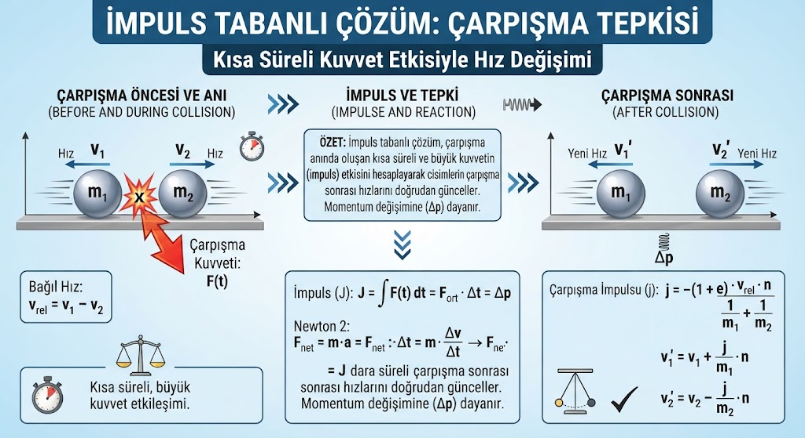

**İmpuls (J):** Kısa süreli kuvvet etkisi.
```
J = F·Δt = Δp = m·Δv
```

**Çarpışma impulsu:**
```
j = -(1 + e) · (v_rel · n) / (1/m₁ + 1/m₂)
```

**Anlaşılır Açıklama:**
- v_rel: Bağıl hız (iki cisim birbirine göre ne kadar hızlı yaklaşıyor)
- n: Çarpışma normali (çarpışma yüzeyine dik vektör)
- e: Esneklik
- m₁, m₂: Kütleler

**Yeni hızlar:**
```
v₁' = v₁ + (j/m₁)·n
v₂' = v₂ - (j/m₂)·n
```

### 7.5 Sürtünme

**Coulomb sürtünmesi:**
```
F_sürtünme = μ · N
```
- μ: Sürtünme katsayısı
- N: Normal kuvvet (yüzeye dik)

**Statik vs Kinetik:**
- Statik: Cisim dururken (daha büyük)
- Kinetik: Cisim hareket ederken (daha küçük)

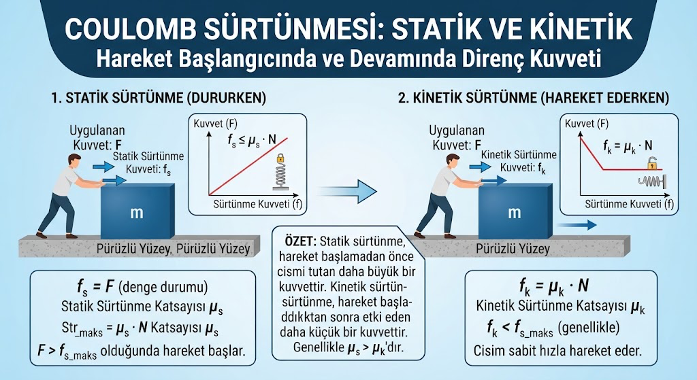

**Malzeme örnekleri:**

| Yüzey | μ |
|---|---|
| Buz | 0.05 |
| Tahta | 0.3 |
| Beton | 0.6 |
| Kauçuk | 0.9 |

### 7.6 Penetrasyon Çözümü

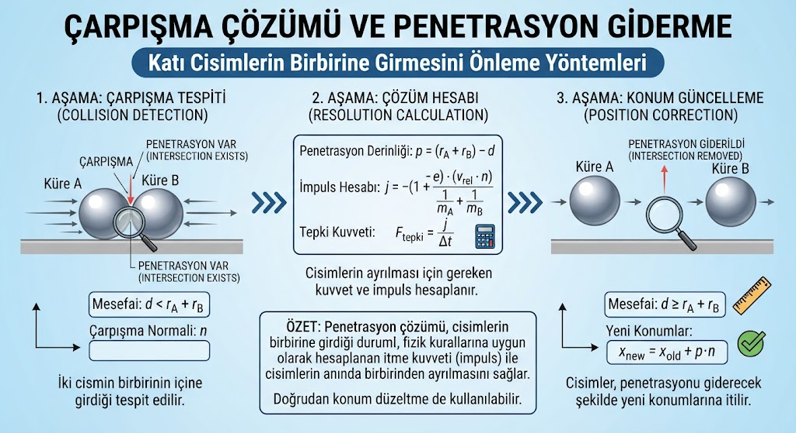

Cisimler iç içe girdiğinde düzeltme:

**Linear projection:**
```
x₁ -= n · (penetration/2) · (m₂/(m₁+m₂))
x₂ += n · (penetration/2) · (m₁/(m₁+m₂))
```

**Anlaşılır Açıklama:** İki cismi birbirinden ayır, kütlelerine göre orantılı.

**Baumgarte stabilizasyonu:**
```
bias = β · penetration / Δt
```
β ≈ 0.1–0.2 (yumuşak düzeltme, titremeyi önler)

### 7.7 CCD (Continuous Collision Detection)

**Sorun:** Hızlı cisimler bir karede duvarı geçebilir.

**Örnek:**
- Mermi: 500 m/s
- Kare süresi: 0.0167 s
- Mermi bir karede: 500 · 0.0167 = 8.35 m yol alır
- 1 m kalınlıkta duvar → mermi duvarı atlar!

**Çözüm:** CCD — cismin yolunu sürekli test et.

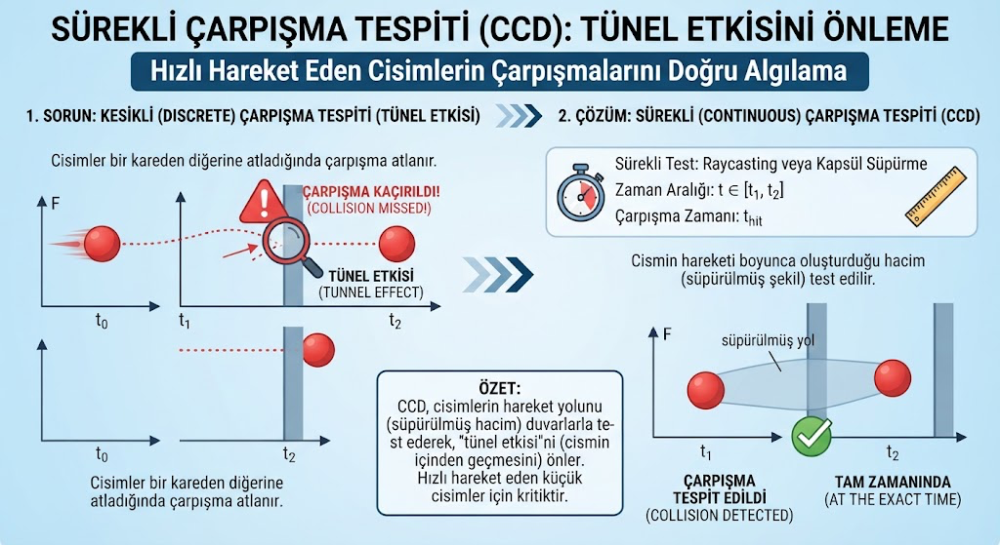

**TOI (Time of Impact):**
```
t_hit = (duvar_x - x₀) / v_x
```

**Örnek:**
```
t_hit = 10 / 500 = 0.02 s
```
Eğer t_hit < Δt ise, çarpışma bu kare içinde gerçekleşir.

**Substepping (Alt Adımlama):**

**Tanım:** Bir kareyi birden fazla küçük fizik adımına bölme.

**Örnek:**
```
Normal: Δt = 0.0167
Substep: Δt = 0.0167 / 4 = 0.0042 (4 alt adım)
```

**Neden kullanılır?**
- Doğruluk artar
- Tünelleme azalır
- Kararlılık artar

**Dezavantaj:** 4× CPU maliyeti.

---

## BÖLÜM 8: RIGID BODY DYNAMICS (KATI CİSİM DİNAMİĞİ)

### 8.1 Rigid Body Nedir?

**Rigid body (katı cisim):** Şekli değişmeyen cisim. Kuvvet uygulanınca bükülmez, kırılmaz, sadece hareket eder ve döner.

**Örnek:** Taş, metal kutu, bilardo topu.

**Karşıt:** Soft body (yumuşak cisim) — kumaş, jöle, lastik.

### 8.2 Lineer vs Açısal Hareket

Katı cisim iki tür hareket yapar:

| Lineer | Açısal | Bağıntı |
|---|---|---|
| Konum (x) | Açı (θ) | — |
| Hız (v) | Açısal hız (ω) | v = ω × r |
| İvme (a) | Açısal ivme (α) | a = α × r |
| Kütle (m) | Atalet momenti (I) | — |
| Kuvvet (F) | Tork (τ) | τ = r × F |
| Momentum (p = mv) | Açısal momentum (L = Iω) | — |

**Ne demek?**
- Lineer: Cismin merkezi nereye gidiyor?
- Açısal: Cisim kendi etrafında nasıl dönüyor?

### 8.3 Atalet Momenti (Moment of Inertia)

**Tanım:** Cismin dönmeye karşı direnci. Kütlenin dönme karşılığı.

**Formül:**
```
I = Σ mᵢ · rᵢ²
```

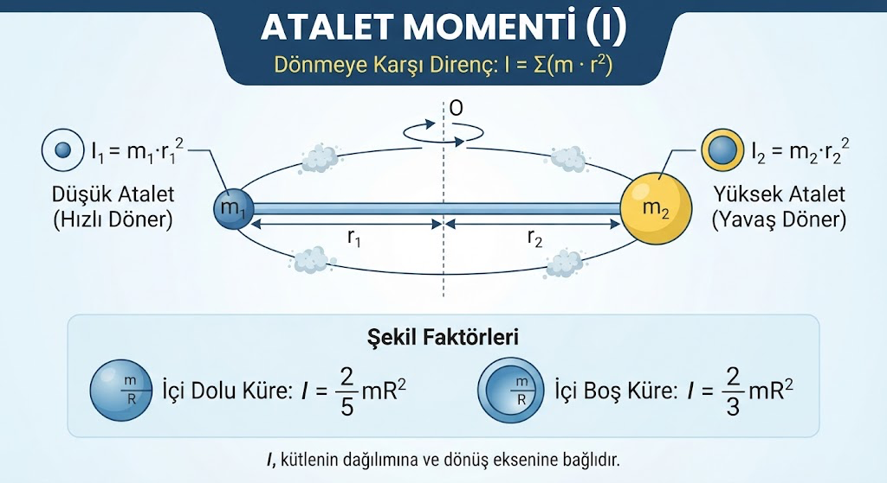

**Şekle göre:**

| Şekil | Atalet Momenti |
|---|---|
| Nokta kütle | I = m·r² |
| İnce çubuk (merkez) | I = (1/12)·m·L² |
| İnce çubuk (uç) | I = (1/3)·m·L² |
| Disk | I = (1/2)·m·R² |
| Halka | I = m·R² |
| Küre (katı) | I = (2/5)·m·R² |
| Küre (içi boş) | I = (2/3)·m·R² |

**Örnek:** 2 kg, 0.5 m yarıçaplı disk:
```
I = ½ · 2 · 0.25 = 0.25 kg·m²
```
10 N·m tork uygulanırsa:
```
α = τ/I = 10/0.25 = 40 rad/s²
```

**Anlaşılır Açıklama:** Aynı tork, küçük atalet momentli cismi daha çok döndürür.

### 8.4 Tork (Döndürme Kuvveti)

```
τ = r × F
```

**Anlaşılır Açıklama:** Kuvvetin döndürme etkisi. Kuvvet ne kadar uzaktan uygulanırsa, tork o kadar büyük.

**Örnek:** 1 m uzaktan 10 N kuvvet:
```
τ = 1 · 10 = 10 N·m
```

**Oyunlarda:** Kapı, sarkaç, tekerlek, kol.

### 8.5 Kütle Merkezi

```
x_cm = (Σ mᵢ·xᵢ) / (Σ mᵢ)
```

**Örnek:** m₁=2 kg (x=0), m₂=3 kg (x=5):
```
x_cm = (2·0 + 3·5) / 5 = 3 m
```

**Oyunlarda:** Denge, devrilme, fırlatma.

### 8.6 Quaternion (Dörtlü) Dönüş

**Sorun:** Euler açıları (x, y, z dönüşü) gimbal lock sorunu yaşar.

**Gimbal Lock:** İki eksen çakışınca bir serbestlik kaybolur.

**Çözüm:** Quaternion.

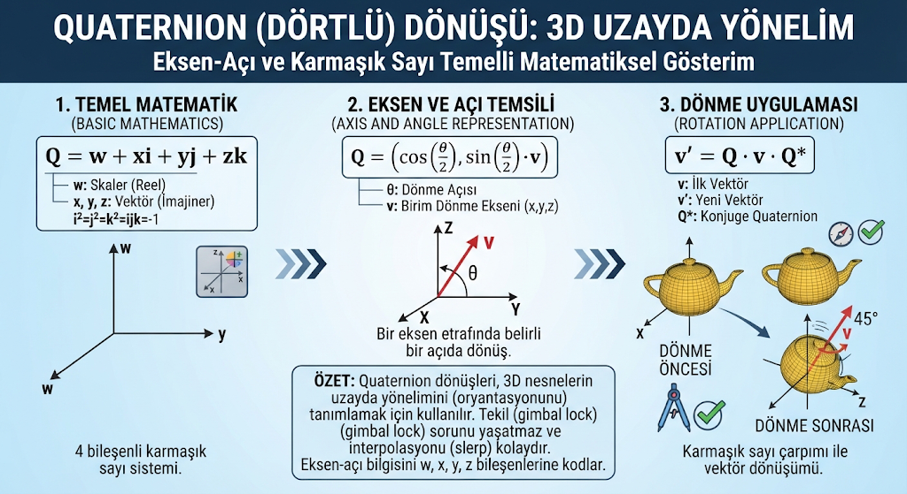

```
q = w + xi + yj + zk
|q| = 1
```

**Dönüş:**
```
v' = q · v · q*
```

**Örnek:** 90° Y ekseni dönüşü:
```
q = (cos45°, 0, sin45°, 0) = (0.707, 0, 0.707, 0)
```

**Avantaj:** Gimbal lock yok, interpolasyon kolay.
**Dezavantaj:** Anlaşılması zor.

---

## BÖLÜM 9: KISITLAMALAR (CONSTRAINTS) VE EKLEMLER (JOINTS)

### 9.1 Kısıtlama Nedir?

**Kısıtlama (constraint):** İki cismin birbirine göre hareketini sınırlayan kural.

**Örnek:** Kapı menteşesi — kapı sadece bir eksende dönebilir.

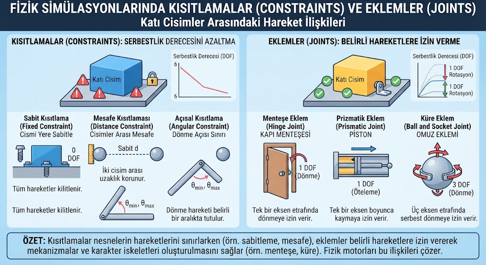

### 9.2 Kısıtlama Türleri

| Kısıtlama | Serbestlik | Örnek |
|---|---|---|
| Distance | Sabit mesafe | Zincir |
| Hinge | 1 eksen dönme | Kapı |
| Ball-socket | 3 eksen dönme | Omuz |
| Slider | 1 eksen kayma | Çekmece |
| Fixed | Hiç | Kaynak |
| Spring | Yay | Trambolin |

### 9.3 Distance Constraint

İki nokta arası mesafe sabit:
```
C = |x₂ - x₁| - L = 0
```

**Çözüm (Verlet):**
```
d = x₂ - x₁
diff = (|d| - L) / |d|
x₁ += 0.5 · diff · d
x₂ -= 0.5 · diff · d
```

**** İki noktayı birbirine doğru veya birbirinden uzağa it, mesafeyi L'ye getir.

### 9.4 Hinge Joint (Menteşe)

Kapı, sarkaç, tekerlek için:
```
C₁ = (x₂ - x₁) · t = 0  (eksenel kayma yok)
C₂ = (x₂ - x₁) · b = 0  (yanal kayma yok)
```

### 9.5 Spring (Yay) — Hooke Yasası

```
F = -k · (x - x₀)
```

**** Yay ne kadar gerilirse, o kadar geri çeker.

**Sönümlemeli:**
```
F = -k·(x - x₀) - c·v
```

**Örnek:** k=100 N/m, x₀=1 m, x=1.5 m:
```
F = -100 · 0.5 = -50 N (geri çekme)
```

**Kritik sönümleme:**
```
c_crit = 2·√(k·m)
```

### 9.6 Constraint Solver

**Tanım:** Kısıtlamaları çözen algoritma.

**Sequential Impulse (Box2D):**
```
for iter in 1..N:
    for each constraint:
        solve(constraint)
```
N ≈ 8–20 iterasyon.

**Anlaşılır Açıklama:** Her kısıtlamayı sırayla çöz, birkaç kez tekrarla.

---

## BÖLÜM 10: İNTEGRASYON YÖNTEMLERİ

### 10.1 İntegrasyon Nedir?

**İntegrasyon:** Diferansiyel denklemleri sayısal olarak çözme yöntemi.

**Oyunlarda:** İvmeden hız, hızdan konum hesaplama.

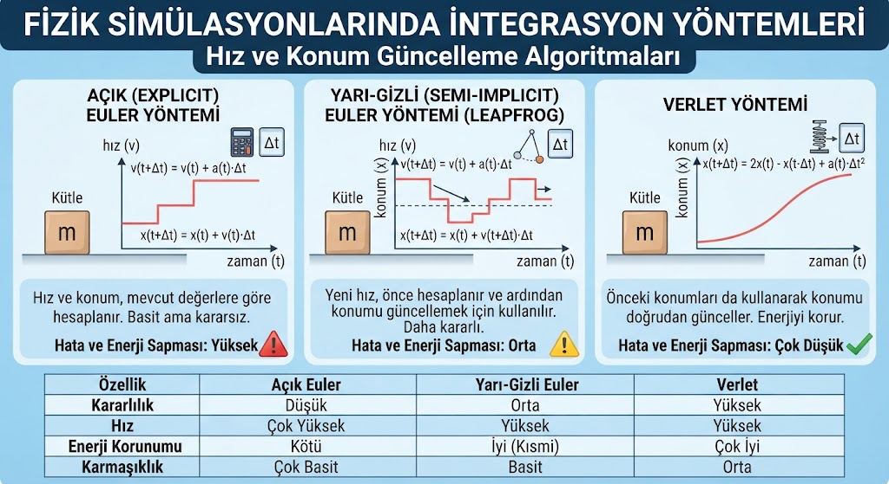

### 10.2 Explicit Euler

```
v += a·Δt
x += v·Δt
```

**Avantaj:** Basit.
**Dezavantaj:** Enerji artar, kararsız.

### 10.3 Semi-Implicit (Symplectic) Euler

```
v += a·Δt
x += v·Δt   ← yeni v kullanılır
```

**Avantaj:** Kararlı, yaygın.
**Dezavantaj:** Hala yaklaşık.

### 10.4 Verlet İntegrasyonu

```
x_new = 2·x - x_old + a·Δt²
```

**Avantaj:** Enerji korunumu iyi.
**Kullanım:** Cloth, particle.

### 10.5 Runge-Kutta 4 (RK4)

```
k₁ = f(t, x)
k₂ = f(t + Δt/2, x + Δt·k₁/2)
k₃ = f(t + Δt/2, x + Δt·k₂/2)
k₄ = f(t + Δt, x + Δt·k₃)
x_new = x + (Δt/6)·(k₁ + 2k₂ + 2k₃ + k₄)
```

**Avantaj:** Yüksek doğruluk.
**Dezavantaj:** 4× maliyet.

### 10.6 Karşılaştırma

| Yöntem | Doğruluk | Maliyet | Kararlılık |
|---|---|---|---|
| Explicit Euler | Düşük | 1× | Kötü |
| Semi-Implicit | Orta | 1× | İyi |
| Verlet | Orta | 1× | Çok iyi |
| RK4 | Yüksek | 4× | İyi |

---

## BÖLÜM 11: ÖZEL FİZİK ALANLARI

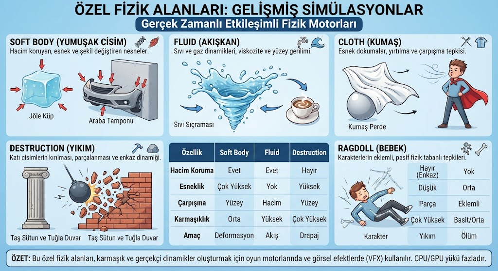

### 11.1 Soft Body (Yumuşak Cisim)

**Tanım:** Şekli değişebilen cisim.

**Yöntem:** Mass-spring system — kütleler + yaylar.

**Kullanım:** Kumaş, lastik, jöle, organ.

### 11.2 Fluid (Akışkan)

**Tanım:** Sıvı ve gaz simülasyonu.

**Yöntemler:**
- **SPH:** Parçacık tabanlı.
- **Grid-based:** Euler grid.
- **PBF:** Position-Based Fluids.

**Navier-Stokes:**
```
∂v/∂t + (v·∇)v = -∇p/ρ + ν∇²v + f
∇·v = 0
```

### 11.3 Cloth (Kumaş)

**Kuvvetler:**
- Yerçekimi
- Yay kuvveti
- Sönümleme
- Çarpışma

### 11.4 Destruction (Yıkım)

- **Pre-fractured:** Önceden kırılmış.
- **Runtime fracture:** Gerçek zamanlı (Voronoi).

### 11.5 Ragdoll

İskelet + eklemler + rigid body.

---

## BÖLÜM 12: OPTİMİZASYON TEKNİKLERİ 

### 12.1 Sleeping (Uyku)

**Ne?** Hareketsiz cisimleri simülasyondan çıkarma.

**Neden?** CPU tasarrufu. 1000 nesnenin 900'ü duruyorsa, sadece 100'ünü hesapla.

**Nasıl?**
```
if (|v| < eşik && |ω| < eşik for T saniye):
    sleep()
```

**Uyanma:** Çarpışma veya kuvvet uygulanınca.

### 12.2 Broad-phase

**Ne?** Olası çarpışma çiftlerini hızlıca bulma.

**Neden?** n² test yerine çok daha az test.

**Nasıl?** AABB, Spatial Hash, BVH.

### 12.3 CCD (Continuous Collision Detection)

**Ne?** Hızlı cisimlerin tünellemesini önleme.

**Neden?** Mermi duvarı geçmesin.

**Nasıl?** Cismin yolunu sürekli test et.

### 12.4 Substepping

**Ne?** Bir kareyi birden fazla küçük fizik adımına bölme.

**Neden?** Doğruluk ve kararlılık artar.

**Nasıl?** Δt'yi N'e böl, N kez simüle et.

### 12.5 Fixed Timestep

**Ne?** Sabit zaman adımı kullanma.

**Neden?** Deterministik ve kararlı.

**Nasıl?** Accumulator yöntemi.

### 12.6 Island Detection

**Ne?** Bağlantılı cisimleri gruplara ayırma.

**Neden?** Paralel çözüm için.

**Nasıl?** Graf bağlantılı bileşenler.

### 12.7 SIMD

**Ne?** Tek komutla birden fazla veri işleme.

**Neden?** 2–4× hız.

**Nasıl?** CPU vektör komutları (SSE, AVX).

### 12.8 Multithreading

**Ne?** Birden fazla CPU çekirdeği kullanma.

**Neden?** 2–8× hız.

**Nasıl?** Island'ları paralel çöz.

### 12.9 GPU Fizik

**Ne?** Fizik hesaplamalarını GPU'da yapma. GPU(Grafik İşlem Birimi), Çok sayıda işi aynı anda (paralel) yapar.

**Neden?** 10–100× hız.

**Nasıl?** CUDA, Compute Shader.

### 12.10 Optimizasyon Tablosu

| Teknik | Kazanç | Zorluk |
|---|---|---|
| Sleeping | %50–90 | Kolay |
| Broad-phase | %70–95 | Orta |
| CCD | %10–30 | Zor |
| Substepping | Doğruluk | Kolay |
| Fixed timestep | Stabilite | Kolay |
| Island | Paralel | Orta |
| SIMD | 2–4× | Zor |
| Multithreading | 2–8× | Zor |
| GPU | 10–100× | Çok zor |

---

## BÖLÜM 13: UYGULAMA — OYUN MEKANİĞİ ANALİZİ

### 13.1 Angry Birds (2D Rigid Body + Yerçekimi)

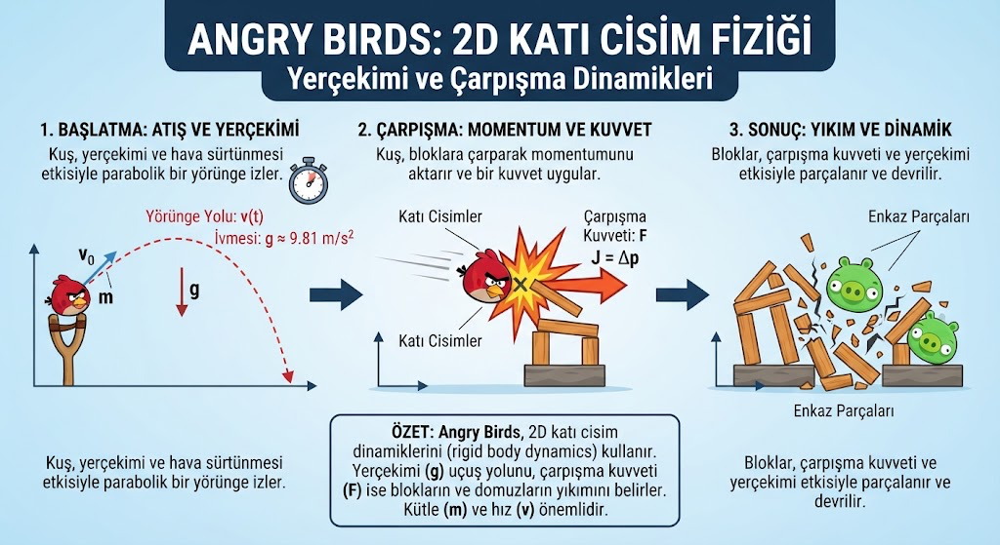

**Fizik motoru:** Box2D

**Mekanik 1: Mermi (kuş) fırlatma — Eğik atış**
```
x(t) = v₀·cos(θ)·t
y(t) = v₀·sin(θ)·t − ½·g·t²
```

**Örnek:** v₀ = 20 m/s, θ = 45°, g = 9.81:
```
Menzil: R = v₀²·sin(2θ)/g = 400/9.81 ≈ 40.8 m
Maks. yükseklik: h = v₀²·sin²θ/(2g) ≈ 10.2 m
```

**Mekanik 2: Çarpışma — Momentum korunumu**
```
m₁v₁ + m₂v₂ = m₁v₁' + m₂v₂'
```

**Mekanik 3: Yapı çöküşü — Tork**
```
τ = r × F
```

**Mekanik 4: Sürtünme**
```
F = μ · N
```
Buz: μ ≈ 0.05, Tahta: μ ≈ 0.3, Taş: μ ≈ 0.6

### 13.2 Portal (Stylized Fizik + Momentum Korunumu)

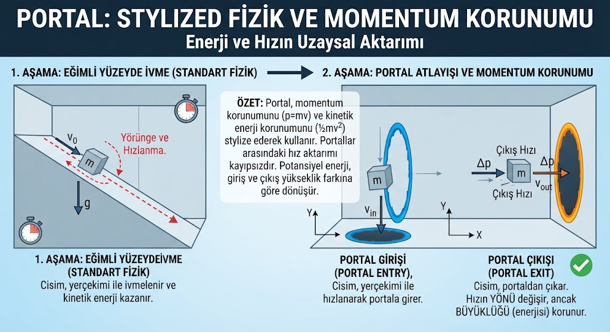

**Fizik motoru:** Source Engine (Havok)

**Mekanik 1: Portal momentum korunumu**
```
v_çıkış = v_giriş (yön değişir)
```

**Mekanik 2: Yerçekimi**
```
v = g·t
h = ½·g·t²
```

**Mekanik 3: Enerji korunumu**
```
mgh = ½mv²
v = √(2gh)
```
10 m yükseklikten: v = √(2·9.81·10) ≈ 14 m/s

**Mekanik 4: Stylized sapmalar**
- Sürtünme yok
- Işınlanma anında ivme sıfır
- Bilinçli tercih

### 13.3 Karşılaştırma

| Mekanik | Angry Birds | Portal |
|---|---|---|
| Fizik türü | 2D Rigid | 3D Stylized |
| Yerçekimi | Gerçekçi | Gerçekçi |
| Momentum | Korunur | Korunur |
| Sürtünme | Malzemeye bağlı | İhmal |
| Amaç | Yıkım | Bulmaca |

---

## 14. Tüm Formüller

| Kavram | Formül |
|---|---|
| Newton 2 | F = m·a |
| Dönme | τ = I·α |
| Momentum | p = m·v |
| Açısal momentum | L = I·ω |
| İmpuls | J = F·Δt = Δp |
| Hooke | F = -k·x |
| Sürtünme | F = μ·N |
| Eğik atış menzil | R = v₀²·sin(2θ)/g |
| Maks. yükseklik | h = v₀²·sin²θ/(2g) |
| Enerji | E = ½mv² + mgh |
| Restitution | e = (v₂'-v₁')/(v₁-v₂) |
| Çarpışma impulsu | j = -(1+e)·v_rel·n/(1/m₁+1/m₂) |
| Yay enerjisi | E = ½kx² |
| Kritik sönümleme | c = 2√(km) |
| Merkez | x_cm = Σmᵢxᵢ/Σmᵢ |

---

## BÖLÜM 15: ÖRNEK PROBLEMLER

### Problem 1: Eğik Atış

**Soru:** 30 m/s hızla 60° açıyla atılan cisim kaç metre uzağa düşer?
```
R = v₀²·sin(2θ)/g = 900·sin(120°)/9.81 = 900·0.866/9.81 ≈ 79.4 m
```

### Problem 2: Çarpışma

**Soru:** 2 kg cisim 5 m/s ile 3 kg duran cisme çarpıyor. e=0.6. Son hızlar?
```
v₁' = ((m₁ - e·m₂)·v₁)/(m₁+m₂) = ((2-1.8)·5)/5 = 0.2 m/s
v₂' = ((1+e)·m₁·v₁)/(m₁+m₂) = (1.6·2·5)/5 = 3.2 m/s
```

### Problem 3: Yay

**Soru:** k=200 N/m yay 0.1 m sıkıştırılmış. 0.5 kg cisim bırakılırsa hız?
```
E = ½kx² = ½·200·0.01 = 1 J
½mv² = 1 → v = √(2/0.5) = 2 m/s
```

### Problem 4: Devrilme

**Soru:** 1 m genişlik, 2 m yükseklik, 10 kg kutu. Devrilme kuvveti?
```
F · 1 > 10·9.81·0.5
F > 49 N
```

### Problem 5: Portal Momentum

**Soru:** Oyuncu 20 m/s ile portala giriyor. Çıkışta hız?
```
v_çıkış = 20 m/s
h = v²/(2g) = 400/19.62 ≈ 20.4 m
```

---

## 16: SON


1. **Oyun fiziği**, gerçek fiziğin yaklaşık simülasyonudur.
2. **Physics engine**, bu simülasyonu soyutlayan yazılımdır.
3. **Gerçekçilik ve performans** arasında ödünleşim vardır.
4. **Arcade vs realistic** fizik, oyun türüne göre seçilir.
5. **Çarpışma tespiti** broad-phase + narrow-phase olarak iki katmanlıdır.
6. **İmpuls tabanlı çözüm** modern motorların temelidir.
7. **İntegrasyon** yöntemi kararlılığı belirler.
8. **Optimizasyon** teknikleri performansı 10-100× artırabilir.


---
